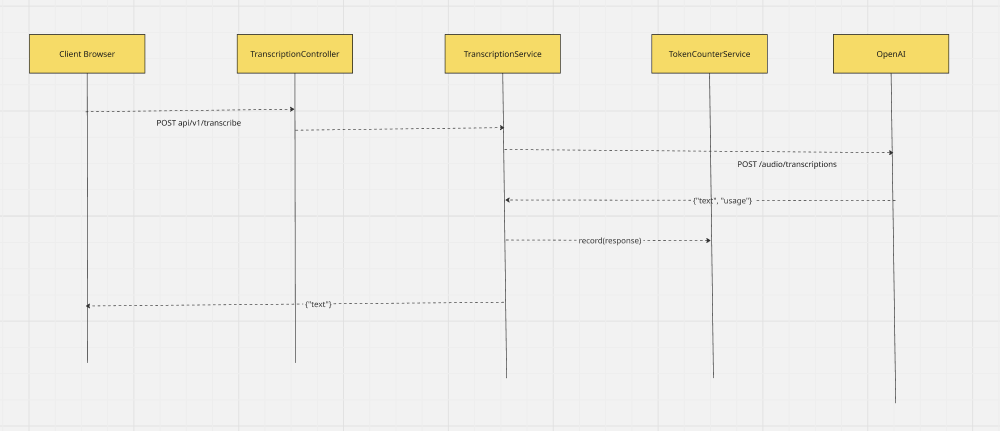

# Architecture & Design

## Request flows


## Layout
```
src/main/java/comp3011/assignment/
├── controllers/
│   ├── TranscriptionController.java
│   ├── AdministrationController.java
│   └── GlobalStatsController.java
├── services/
│   ├── TranscriptionService.java
│   └── TokenCounterService.java
└── components/
    ├── exceptions/
    │   └── ApiExceptionHandler.java
    ├── responses/
    │   ├── UptimeResponse.java
    │   ├── GlobalStatsResponse.java
    │   ├── ShutdownResponse.java
    │   └── ErrorResponse.java
    └── shutdown/
        ├── ApplicationTerminator.java
        └── SpringApplicationTerminator.java
```
 
The **`controllers/`** folder holds the REST endpoints. Each controller deals only with
HTTP concerns, reading the request, choosing the status code, and returning the body.

The **`services/`** folder holds the application logic, split across two services. The
**`TranscriptionService`** owns the OpenAI integration, which means that it builds the multipart request, sends it, reads the response, and returns the transcribed text. The **`TokenCounterService`**
keeps the running token totals, which are shared across all requests and updated after
every transcription.

The **`components/`** folder holds the supporting pieces, grouped by concern. The
**`exceptions/`** package contains `ApiExceptionHandler`, a global `@RestControllerAdvice`
that turns every error (400, 413, 500) into one consistent JSON shape. The **`responses/`**
package contains the immutable DTO records whose field names map directly to the JSON the
API returns. The **`shutdown/`** package contains the graceful shutdown mechanism, where
**`ApplicationTerminator`** is worth noting. **`ApplicationTerminator`** is an interface that isolates the actual shutdown, so the shutdown endpoint can be tested with a mock instead of really killing the
process.

Every dependency is wired through constructor injection, which keeps the layers decoupled
and makes each one easy to test on its own.

## Design decisions
 
**Why virtual threads for concurrency?**
Each transcription blocks for a second or two waiting on OpenAI. Ordinary platform
threads are a limited resource, so a few hundred concurrent requests would exhaust
the pool and later requests would stall. Virtual threads make blocking cheap, so the
app can hold hundreds of blocked requests at once while keeping the code simple
(straightforward blocking calls, no reactive complexity).
 
**Why `LongAdder` for the token counter?**
The counter is written by every transcription and read by the stats endpoint. Under
heavy concurrent writes, `LongAdder` scales better than a single atomic value and
guarantees no updates are lost. Correctness under concurrency is the requirement, so
a plain `long` (which loses updates when threads collide) was not an option.
 
**Why an `ApplicationTerminator` interface?**
Shutting the server down is impossible to unit-test. If the controller closes the
context directly, the test would kill itself. Putting the shutdown behind an
interface lets tests inject a harmless mock, so the shutdown endpoint's `202`/`409`
logic can be verified without actually stopping anything.
 
**Why one global exception handler?**
A single `@RestControllerAdvice` (`ApiExceptionHandler`) routes every exception type
to the matching handler, so all error responses share one consistent shape and the
logic lives in one place.

**Why use CountDownLatch for testing concurrency?**
A race only appears when threads act at the same instant. Starting them in a loop lets the
early threads finish before the late ones begin, so a race might never happen and the test
could pass on broken code. I choose the CountDownLatch to hold every thread at a shared gate, then release them together, forcing maximum overlap so a passing test genuinely proves the counter is
thread-safe.